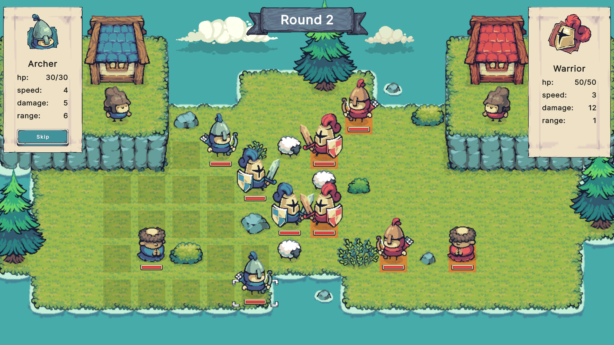

# TinySwords

A simple pixel art strategy game prototype made with Unity.

This is my first Unity learning project, completed in a week with almost no prior experience with Unity. I used C# before, but that was a while ago, in a WPF project. I love funny pixel art assets and HoMM2, hence the setting and the gameplay. It's also an attempt to complete a certain GD school project on my own - to create a simple HoMM-like strategy game with at least 3 different units moving on a square or hexagonal tile map.

Gameplay on YouTube: https://www.youtube.com/watch?v=O13rwDyiRJo

Pixel art assets: Tiny Swords by Pixel Frog (https://pixelfrog-assets.itch.io/tiny-swords)

Music: Stealth Battle by meak363 (https://pixabay.com/music/main-title-stealth-battle-205902/)